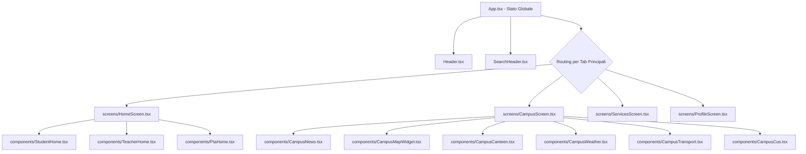

# Documentazione Tecnica dell'Applicazione UnisAllRound

Questa documentazione fornisce una descrizione rigorosa, precisa e dettagliata di ciascuna schermata, componente, utility e logica di stato che costituiscono l'applicazione **UnisAllRound**. L'applicazione è un client mobile multipiattaforma sviluppato in **React Native (Expo)** con linguaggio **TypeScript**, progettato per centralizzare e ottimizzare l'esperienza accademica della comunità dell'Università degli Studi di Salerno (UNISA).

L'app adatta le sue funzionalità e l'interfaccia a seconda del ruolo dell'utente autenticato: **Studente**, **Docente o **PTA (Personale Tecnico Amministrativo)**.

---

## 1. Architettura dell'Applicazione e File di Sistema (Frontend)

L'architettura segue il paradigma dell'unidirezionalità del flusso dei dati, in cui lo stato centrale è orchestrato dall'hook custom `useAppState` (in `src/hooks/useAppState.ts`) e distribuito a cascata (o tramite callback) ai vari componenti e schermate.

### 1.1. Diagramma dei Componenti Principali

### 1.2. File di Configurazione e Stile Principali

*   **`App.tsx`**: Entry-point dell'applicazione. Inizializza l'hook `useAppState`, effettua il bootstrap dello stato (compresa la lingua e il ripristino della sessione), gestisce la visualizzazione delle schermate di caricamento (booting) e implementa la struttura complessiva della pagina con l'Header superiore, il corpo scrollabile della schermata attiva e la barra di navigazione inferiore (`BottomNav`).
*   **`src/theme.ts`**: Centralizza la palette cromatica dell'applicazione e le costanti grafiche in modalità chiara (light mode, con esclusione totale della modalità scura come richiesto). Utilizza combinazioni di tonalità HSL per un aspetto pulito e pastello:
    *   *Primary (Teal)*: `#137C8B` (tinta principale dell'app per gli studenti).
    *   *Teacher Accent (Amber)*: `#E27E07` (tinta per l'area docenti).
    *   *PTA Accent (Coral)*: `#D96C4A` (tinta per l'area amministrativa).
    *   *Sfondi e Bordo*: sfondi leggeri (`#F8FAFC`, `#F1F5F9`) e bordi morbidi.
    *   *Shadows e Border Radii*: definisce i livelli di arrotondamento e le ombreggiature standard per le card.
*   **`src/styles.ts`**: Raccoglie tutti gli stili condivisi in formato StyleSheet di React Native per garantire uniformità e massimizzare le performance di rendering degli elementi grafici (pulsanti, card, container, form, righe di elenchi).
*   **`src/types.ts`**: Definisce i tipi TypeScript e le interfacce per modellare i dati dell'applicazione: `UserProfile`, `Exam`, `Lesson`, `Ticket`, `NotificationItem`, `CanteenMenuData`, `ReceptionSlot`.
*   **`src/constants.ts`**: Contiene costanti globali quali la porta e l'IP del backend (`BACKEND_URL`), le chiavi di persistenza locale per `AsyncStorage` (`STORAGE_KEYS`), e il dizionario multilingua (Italiano `IT` e Inglese `EN`) per l'internazionalizzazione dinamica di tutte le stringhe di testo.

---

## 2. Lo Stato Globale dell'Applicazione (`src/hooks/useAppState.ts`)

L'hook `useAppState.ts` rappresenta il motore logico di UnisAllRound. Incapsula lo stato, le chiamate API e la gestione della persistenza locale.

### 2.1. Variabili di Stato Gestite
*   `currentUser`: Profilo dell'utente correntemente loggato.
*   `users`: Database locale degli utenti per operazioni offline e di sincronizzazione.
*   `authDraft`: Dati compilati temporaneamente nel form di login/registrazione.
*   `profileDraft`: Dati in fase di modifica nella schermata del profilo.
*   `exams`: Lista degli esami del libretto dello studente.
*   `tickets`: Richieste di assistenza inviate o gestite.
*   `receptionSlots`: Fasce orarie configurate per i ricevimenti dei docenti.
*   `customNotifications`: Notifiche destinate all'utente.
*   `archivedNotifIds` / `deletedNotifIds`: Array di ID per gestire lo stato di archiviazione/eliminazione delle notifiche.
*   `weatherData`: Condizioni meteorologiche caricate per i campus di Fisciano e Baronissi.
*   `canteenMenu`: Menu settimanale dei pasti della mensa universitaria.
*   `searchTerm`: Parola chiave inserita dall'utente nella barra di ricerca superiore.

### 2.2. Logiche di Sincronizzazione e Fallback
L'applicazione implementa un meccanismo ibrido di memorizzazione:
1.  **Chiamate API (`src/api.ts`)**: Ad ogni avvio, login o aggiornamento, l'app tenta di comunicare con il backend Node.js/Express per persistere o scaricare i dati agganciati ai database.
2.  **Persistenza in `AsyncStorage`**: Se la connessione al server fallisce o va in timeout (configurato a 8000ms), l'app cattura l'eccezione, mostra un avviso non bloccante e ricorre ai dati storici salvati in locale, garantendo la totale operatività dell'applicazione anche offline.

### 2.3. Logiche di Validazione e Registrazione
Il metodo `handleRegister` impone controlli stringenti in fase di iscrizione per conformarsi ai requisiti accademici:
*   **Obbligatorietà dei Campi**: Tutti i campi contrassegnati con l'asterisco (`*`) sono bloccanti per la registrazione. L'unico campo facoltativo è il numero di telefono.
*   **Gestione dei Domini Email**:
    *   Per registrarsi come **Studente**, è obbligatorio inserire un indirizzo email istituzionale terminante con `@studenti.unisa.it`.
    *   Per registrarsi come **Docente** o **PTA**, l'email deve terminare con `@unisa.it`.
    *   **Riconoscimento Automatico**: Non appena l'utente digita un'email che contiene il dominio `@studenti.unisa.it`, il sistema imposta automaticamente il selettore del ruolo su "Studente" e ne disabilita il cambio manuale.
*   **Matricola**: Obbligatoria per gli studenti, deve essere composta da esattamente 10 caratteri numerici. Viene controllata l'unicità all'interno del sistema.
*   **Validazione Nome/Cognome**: Possono contenere solo lettere, spazi, apostrofi o trattini singoli, evitando caratteri speciali abusivi.
*   **Robustezza della Password**: Lunghezza compresa tra 8 e 16 caratteri, obbligo di almeno una lettera maiuscola e di almeno un carattere speciale.
*   **Unicità del Telefono**: Impedisce registrazioni multiple che condividano lo stesso recapito telefonico.

### 2.4. Calcolo Dinamico delle Statistiche di Carriera
Tramite memoizzazione React (`useMemo`), le statistiche dello studente vengono ricalcolate solo alla variazione degli esami accettati:
*   `completed`: Numero di esami superati registrati con stato "Accettato".
*   `cfu`: Somma aritmetica dei CFU associati a ciascun esame superato.
*   `arithmetic`: Media aritmetica semplice dei voti (esclusi gli idonei/approvati senza voto numerico).
*   `weighted`: Media ponderata dei voti (moltiplicando ciascun voto per i rispettivi CFU e dividendo per la somma totale dei CFU degli esami con voto numerico).
*   `progress`: Avanzamento in percentuale (`cfu / targetCfu * 100`), dove `targetCfu` viene dedotto dal corso di laurea selezionato (es. 180 per le triennali, 120 per le magistrali).

### 2.5. Instradamento delle Notifiche al Click
All'interno del `NotificationDetailModal`, se l'utente clicca sul pulsante "Apri", il sistema esegue una scansione testuale del contenuto della notifica per deviare l'utente sul tab specifico:
*   Contiene parole chiave relative a voti/esami $\to$ Reindirizza alla Home per gestire l'esito.
*   Contiene parole chiave relative a mensa/pasti $\to$ Apre il CampusScreen posizionandosi sul modulo Mensa.
*   Contiene parole chiave relative a ticket/assistenza $\to$ Apre il ServicesScreen posizionandosi sulla scheda dei ticket.
*   Contiene parole chiave relative a ricevimento/prenotazioni $\to$ Reindirizza alla sezione ricevimenti della Home dello studente o del docente.

---

## 3. Le Schermate Principali (`src/screens/`)

### 3.1. `AuthScreen.tsx`
Gestisce le fasi di accesso e prima registrazione degli utenti. 
*   **Modalità Login**: Campi email e password con l'opzione "Ricorda sessione" (memorizza l'ID utente in `AsyncStorage`).
*   **Modalità Registrazione**: Mostra form dinamici a seconda del ruolo selezionato. Se il ruolo è "Studente", compaiono i campi specifici "Matricola" e "Corso di Laurea". Se il ruolo è "Docente", mostra un selettore multiscelta per selezionare le materie e i relativi corsi di studio di competenza. Se il ruolo è "PTA", mostra un picker per definire il dominio amministrativo di appartenenza (es. Area Didattica).
*   **Account Demo**: Per motivi di sicurezza e pulizia dell'esperienza utente iniziale, i pulsanti rapidi e le etichette degli account demo pre-costituiti sono stati rimossi dalla schermata visibile (come da richiesta).

### 3.2. `HomeScreen.tsx`
Rappresenta il punto d'ingresso principale post-autenticazione. Analizza il campo `currentUser.role` ed effettua il rendering condizionale del widget specifico per il ruolo dell'utente:
*   `StudentHome` se l'utente è uno studente.
*   `TeacherHome` se l'utente è un docente.
*   `PtaHome` se l'utente appartiene al Personale Tecnico Amministrativo.

### 3.3. `CampusScreen.tsx`
Aggrega tutte le funzionalità logistiche e informative legate alla vita quotidiana del campus. Rende visibile un menu orizzontale a schede per navigare tra i seguenti widget integrati:
1.  **Mappa**: `CampusMapWidget`
2.  **News**: `CampusNews`
3.  **Mensa**: `CampusCanteen`
4.  **Meteo**: `CampusWeather`
5.  **Trasporti**: `CampusTransport`
6.  **CUS**: `CampusCus`

### 3.4. `ServicesScreen.tsx`
Contiene gli strumenti di supporto e consultazione:
*   **FAQ**: Sezione espandibile contenente le risposte alle domande più frequenti degli utenti accademici.
*   **Crea Ticket**: Modulo form per segnalare disservizi. Permette di inserire un titolo, la localizzazione fisica del problema (es. Blocco F, Mensa), una descrizione dettagliata ed il livello di priorità. Il ticket viene indirizzato automaticamente all'area PTA competente.
*   **Visualizza Ticket**: Elenco dei ticket inseriti dall'utente con relativi badge di stato aggiornati in tempo reale (Aperto, In Carico, Sospeso, Chiuso).
*   **Invia Feedback**: Modulo per inviare un messaggio testuale diretto agli sviluppatori dell'applicazione.

### 3.5. `ProfileScreen.tsx`
Fornisce all'utente il controllo sui propri dati personali:
*   **Visualizzazione Info**: Riepiloga Matricola, Ruolo, Email e Dipartimento.
*   **Modifica Profilo**: Consente l'aggiornamento dinamico del Corso di Laurea, del Dipartimento, del telefono o delle materie insegnate (a seconda del ruolo).
*   **Cambio Password**: Modulo per aggiornare le credenziali di accesso previa validazione della password corrente e verifica dei requisiti di sicurezza sulla nuova.
*   **Opzioni Internazionali**: Scelta rapida della lingua dell'applicazione (Italiano/Inglese), con aggiornamento immediato di tutte le etichette.
*   **Logout**: Cancella la sessione persistente locale in `AsyncStorage` e riporta l'utente alla schermata di login.

---

## 4. Componenti Atomici e Riutilizzabili (`src/components/`)

### 4.1. Componenti di Input e Selezione

#### `Field.tsx`
Componente standardizzato per la raccolta di dati testuali.
*   **Props**: `label`, `value`, `onChangeText`, `placeholder`, `secureTextEntry`, `keyboardType`, `editable`, `error`.
*   **Logica**: Dispone di uno stato interno `isSecure` (booleano). Se `secureTextEntry` è attivo, inserisce sulla destra un'icona interattiva (`Eye` / `EyeOff`) per nascondere o mostrare la password in chiaro.

#### `CustomPicker.tsx`
Menu a discesa personalizzato sviluppato per evitare discrepanze grafiche tra Android, iOS e Web.
*   **Props**: `label`, `selectedValue`, `options` (array di oggetti `{label, value}`), `onValueChange`, `placeholder`.
*   **Logica**: Cliccando sull'input, si apre un `Modal` a tutto schermo che ospita uno `ScrollView`. L'utente seleziona la voce desiderata, che viene evidenziata con un'icona di spunta (`Check`) prima di chiudere automaticamente il modal.

#### `DomainPicker.tsx`
Specializzazione del `CustomPicker` per i compiti del personale PTA.
*   **Props**: `selectedValue`, `onValueChange`.
*   **Logica**: Propone l'elenco statico dei dipartimenti e delle aree lavorative PTA (es. Area Didattica, Uffici Carriere, Manutenzione Strutture, Servizi Informatici, Gestione Mensa).

#### `MultiSelectPicker.tsx`
Selettore a scelta multipla, essenziale per i docenti che devono associare il proprio profilo a più insegnamenti o corsi di studio.
*   **Props**: `label`, `options`, `selectedValues` (array di stringhe), `onValuesChange`, `placeholder`.
*   **Logica**: Mostra un modal in cui ciascun elemento dell'elenco presenta una casella di controllo. Il tap su un elemento aggiunge o rimuove il relativo codice dall'array di output.

#### `RolePicker.tsx`
Pannello per la selezione rapida del ruolo utente in fase di registrazione.
*   **Props**: `selectedRole`, `onRoleChange`.
*   **Logica**: Un controllo a tre pulsanti affiancati con icone abbinate (`GraduationCap` per Studente, `BookOpen` per Docente, `Briefcase` per PTA). Evidenzia il ruolo attivo con un colore di sfondo pastello abbinato al tema del ruolo.

#### `SegmentedControl.tsx`
Componente a tab orizzontali ad alto contrasto per commutare rapidamente tra due visualizzazioni.
*   **Props**: `values` (es. `['Attive', 'Archivio']`), `selectedIndex`, `onChange`.
*   **Logica**: Disegna i pulsanti distribuiti equamente sulla larghezza disponibile, applicando uno sfondo colorato per evidenziare il segmento attivo.

### 4.2. Pulsanti e Indicatori Visivi

#### `ActionButton.tsx`
Il pulsante principale dell'applicazione per le chiamate all'azione.
*   **Props**: `title`, `onPress`, `variant` (`primary`, `secondary`, `danger`), `loading`, `disabled`, `icon` (icona opzionale).
*   **Logica**: Gestisce lo stato disabilitato o di caricamento (sostituendo il testo con un `ActivityIndicator`).

#### `IconButton.tsx`
Un pulsante compatto e circolare che ospita unicamente un'icona.
*   **Props**: `icon` (Lucide Icon Component), `onPress`, `color`, `backgroundColor`, `size`.

#### `StatusBadge.tsx`
Etichetta colorata per comunicare lo stato di avanzamento di un ticket.
*   **Props**: `status` (`Aperto`, `In carico`, `Sospeso`, `Chiuso`).
*   **Logica**: Associa una colorazione HSL specifica basata sullo stato (Rosso per aperto, Giallo per sospeso, Teal per in carico, Verde per chiuso).

### 4.3. Elementi Grafici di Layout e Liste

#### `SectionTitle.tsx`
Visualizza intestazioni di sezione eleganti e coerenti.
*   **Props**: `title`, `subtitle`.

#### `ServiceTile.tsx`
Card quadrate con layout a griglia utilizzate nella schermata dei servizi.
*   **Props**: `title`, `icon`, `onPress`, `color`.

#### `StatCard.tsx`
Card statistiche per la visualizzazione sintetica di dati quantitativi.
*   **Props**: `title`, `value`, `icon`, `tone` (`green`, `blue`, `amber`, `coral`, `purple`), `onPress`.
*   **Logica**: Genera sfondi pastello coordinati con le icone per massimizzare la leggibilità dei numeri principali.

#### `StatPill.tsx`
Versione ultracompatta a forma di pillola per mostrare piccoli indicatori testuali accostati ad altre informazioni.
*   **Props**: `label`, `value`.

#### `ListRow.tsx`
La riga di elenco più versatile dell'applicazione.
*   **Props**: `icon`, `title`, `subtitle`, `rightText`, `badge`, `onPress`, `expandedContent`, `isExpanded`.
*   **Logica**: Se viene fornito `expandedContent`, la riga mostra un Chevron interattivo e, al tocco, espande una sezione inferiore mostrando informazioni di dettaglio aggiuntive (es. dettagli orario lezione o note di un ticket).

#### `SwipeableRow.tsx`
Fornisce l'interattività a scorrimento (swipe) per le righe delle notifiche e dei ticket.
*   **Props**: `children`, `onSwipeLeft` (archiviazione), `onSwipeRight` (eliminazione), `leftLabel`, `rightLabel`.
*   **Logica**: Sviluppato utilizzando `PanResponder` e la libreria `Animated` di React Native. Traccia il movimento del dito: uno scorrimento verso sinistra rivela un pannello arancione per l'archiviazione, mentre uno scorrimento verso destra rivela un pannello rosso per l'eliminazione.

---

## 5. Moduli Specifici per Ruolo Utente (Frontend)

### 5.1. `StudentHome.tsx`
Fornisce la plancia di comando per lo studente accademico.
*   **Visualizzazione Carriera**: Rende disponibili 4 `StatCard` (Esami superati, Media ponderata, Media aritmetica, CFU conseguiti).
*   **Barra di Progresso**: Barra grafica orizzontale che indica visivamente il progresso della carriera rispetto ai CFU richiesti dal corso di studi.
*   **Modali di Dettaglio**:
    *   `PassedExamsModal`: Consente di consultare lo storico cronologico di tutti gli esami superati con voto ed eventuale lode.
    *   `StudyPlanModal`: Visualizza tutte le materie del libretto universitario categorizzate per stato: Verde (Superate), Giallo (In attesa di esito), Grigio (Da sostenere).
    *   `DeleteConfirmModal`: Misura di sicurezza per impedire rimozioni accidentali di esami registrati manualmente. Richiede l'inserimento della password dell'account e della matricola prima di autorizzare la cancellazione.
*   **Modulo Registrazione Esame**: Consente allo studente di registrare esami superati non ancora presenti nel sistema. Selezionando l'insegnamento dal picker, il sistema imposta automaticamente i CFU previsti da database.
*   **Esiti d'Esame**: Elenco dei voti proposti dai docenti. Lo studente può accettare (registrando l'esame nel libretto) o rifiutare (rimuovendo la proposta) la valutazione con un clic.
*   **Ricevimento Docenti**: Sezione per prenotare gli incontri con i professori. Permette di filtrare i giorni della settimana per visualizzare le fasce orarie libere configurate dai docenti per le materie nel piano di studi dello studente.

### 5.2. `TeacherHome.tsx`
Hub operativo riservato ai docenti.
*   **Dashboard Numerica**: Indica i corsi attivi tenuti dal docente, il numero degli studenti iscritti, i messaggi di bacheca inviati e le ore settimanali di ricevimento.
*   **Gestione Corsi**: Mostra le aule, gli orari e il materiale didattico associato a ciascun insegnamento.
*   **Inserimento Esiti**: Form per caricare i voti degli esami. Selezionando un corso, il sistema recupera l'elenco degli studenti iscritti e ne compila il picker per facilitare la selezione e la digitazione del voto.
*   **Bacheca Annunci**: Consente di redigere avvisi testuali da inviare come notifica push a tutti gli studenti iscritti o a corsi selezionati.
*   **Calendario Ricevimenti**: Consente al docente di pianificare le fasce orarie per incontrare gli studenti. Premendo su una fascia oraria libera, il docente può attivarla inserendo note logistiche (es. "Studio F3" o "Teams"). Se uno studente prenota lo slot, il nome dello studente compare in tempo reale accanto allo slot.

### 5.3. `PtaHome.tsx`
Interfaccia di monitoraggio per lo staff tecnico amministrativo (PTA).
*   **Riepilogo Attività**: Mostra il carico di lavoro quotidiano (ticket aperti, ticket in carico all'operatore loggato).
*   **Gestione Ticket**: Elenca le richieste di assistenza inerenti al dominio dell'operatore (es. un manutentore vedrà i ticket indirizzati all'Area Manutenzione). L'operatore può:
    *   Prendere in carico il ticket (stato $\to$ "In carico").
    *   Sospendere l'intervento in attesa di pezzi o verifiche (stato $\to$ "Sospeso").
    *   Chiudere il ticket a intervento completato (stato $\to$ "Chiuso").
*   **Archivio Storico**: Sezione dotata di filtri temporali rapidi (Giorno, Mese, Anno) per consultare i ticket del passato e analizzare i tempi di risoluzione.

---

## 6. Widget Informativi del Campus (`src/components/`)

### 6.1. `CampusMapWidget.tsx`
Fornisce una mappa geografica interattiva basata sulla libreria JavaScript **Leaflet**, caricata tramite una `WebView` (o un `iframe` in ambiente Web).
*   **Mappa Personalizzata**: Visualizza i confini stradali dei campus di Fisciano e Baronissi. Dispone di controlli zoom e pulsanti di commutazione stile mappa (Stradale standard / Immagine Satellitare). **La variante con rilievo del terreno ("Rilievo") è stata disattivata per ottimizzare la leggibilità.**
*   **Geocoding in tempo reale**: L'utente può cliccare in qualsiasi punto della mappa; il widget intercetta le coordinate geografiche, effettua una chiamata alle API pubbliche di **Nominatim OpenStreetMap** ed elabora l'indirizzo testuale (via, CAP, comune) mostrandolo in un box informativo in basso.
*   **GPS Navigation Launcher**: Dispone di pulsanti per lanciare le applicazioni di navigazione nativa del dispositivo (Apple Maps su iOS, Google Maps su Android) con le coordinate esatte del punto d'interesse selezionato.

### 6.2. `CampusNews.tsx`
Raccoglie e visualizza i comunicati stampa e gli avvisi ufficiali dell'Ateneo.
*   **Logica**: Effettua il fetching remoto e il parsing del codice HTML del portale istituzionale UNISA (tramite la funzione `fetchUnisaNews`). In caso di assenza di rete, ricorre a un feed di notizie di emergenza pre-configurato.

### 6.3. `CampusCanteen.tsx`
Pannello informativo dedicato alla ristorazione universitaria gestita dall'ADISURC.
*   **Logica**: Effettua il fetching in tempo reale dell'indirizzo del menu giornaliero ADISURC. Mostra i piatti suddivisi per pranzo e cena per ciascun giorno della settimana (Primo, Secondo, Contorno, Frutta/Dolce). Offre un pulsante rapido per aprire o scaricare il PDF originale dal portale ADISURC.

### 6.4. `CampusWeather.tsx`
Mostra le informazioni meteo attuali dei campus.
*   **Logica**: Esegue interrogazioni periodiche alle API meteo di **OpenMeteo**, prelevando temperatura, velocità del vento e codice climatico (WMO code) per le coordinate geografiche di Fisciano e Baronissi. Mappa il codice numerico a icone grafiche appropriate (`Sun`, `Cloud`, `CloudRain`, ecc.) e stringhe testuali in lingua.

### 6.5. `CampusTransport.tsx`
Fornisce orari e percorsi del trasporto pubblico per pendolari.
*   **Logica**: Suddivide le autolinee per area geografica (Salerno, Avellino, Napoli, Benevento). Al click su una corsa, costruisce una linea temporale verticale (timeline) che illustra le fermate intermedie con i relativi orari calcolati.
*   **Mappa Stalli**: Mostra una piantina grafica schematica del Terminal Bus di Fisciano, evidenziando la numerazione degli stalli per ciascuna autolinea per orientare l'utente all'arrivo nel campus.

### 6.6. `CampusCus.tsx`
Pannello dedicato alle attività sportive del Centro Universitario Sportivo.
*   **Logica**: Elenca i corsi disponibili (sala pesi, tennis, calcetto, atletica) con orari e tariffe. Include un modale che consente di avviare azioni esterne rapide tramite schema URI: chiamata telefonica diretta (`tel:`), avvio email precompilata (`mailto:`), apertura chat WhatsApp (`whatsapp://`) o apertura del profilo Instagram ufficiale del CUS Salerno.

---

## 7. Header e Componenti di Notifica

### 7.1. `Header.tsx`
Barra superiore fissa. Mostra il logo istituzionale, il titolo dell'app e un badge con il ruolo dell'utente (con codice colore dedicato). Ospita l'icona della campanella per le notifiche, che visualizza un badge numerico rosso con il conteggio delle notifiche attive non ancora lette o archiviate.

### 7.2. `SearchHeader.tsx`
Casella di input per la ricerca globale. Confronta il testo inserito con i metadati delle funzionalità dell'applicazione. Al click su un risultato, cambia automaticamente la scheda attiva navigando direttamente alla sezione desiderata (es. digitando "mensa" e cliccando sul risultato, l'app passa al CampusScreen ed attiva la mensa).

### 7.3. `NotificationsModal.tsx`
Pannello modale per la gestione delle notifiche. Divide i messaggi in due schede tramite `SegmentedControl`: "Attive" e "Archiviate". Ciascuna riga è inserita all'interno di un `SwipeableRow` per consentire l'archiviazione (swipe a sinistra) o la cancellazione permanente (swipe a destra).

### 7.4. `NotificationDetailModal.tsx`
Mostra il contenuto completo di un avviso. Implementa il pulsante d'azione contestuale "Apri" basato sull'analisi del testo del messaggio (descritta al paragrafo 2.5).

---

## 8. Modulo API e Utility di Supporto (Frontend)

### 8.1. Client API (`src/api.ts`)
Fornisce i metodi asincroni per comunicare con il server Express. Configura una funzione helper `apiRequest` con un timeout di 8 secondi ed una gestione centralizzata degli errori di rete. Mappa le seguenti rotte:
*   `/api/auth/login` (POST): Validazione credenziali.
*   `/api/auth/register` (POST): Creazione nuovo account.
*   `/api/profile` (PUT): Aggiornamento dati profilo.
*   `/api/exams` (GET/POST/PUT/DELETE): Gestione libretto esami studente.
*   `/api/tickets` (GET/POST/PUT): Gestione ticket disservizi.
*   `/api/slots` (GET/POST/PUT/DELETE): Gestione orari ricevimento docenti.
*   `/api/notifications` (GET/POST): Invio e ricezione notifiche push simulate.
*   `/api/canteen/menu` (GET): Recupero menu mensa sincronizzato.

### 8.2. Utility Funzionali (`src/utils.ts`)
Contiene funzioni pure riutilizzabili:
*   `isInstitutionalEmail`: Controlla tramite espressione regolare la formattazione dell'indirizzo email e la presenza dei domini consentiti.
*   `isPasswordValid`: Controlla la presenza di lettere maiuscole e caratteri speciali.
*   `decodeHtmlEntities`: Pulisce i testi prelevati dal sito UNISA convertendo le entità HTML (es. `&amp;` $\to$ `&`, `&ograve;` $\to$ `ò`).
*   `fetchUnisaNews`: Effettua la richiesta HTTP al sito ufficiale UNISA, estrae il blocco HTML `<h2>bacheca</h2>` e tramite espressioni regolari compila un array strutturato di oggetti `NewsItem` contenenti titolo, sommario, tag della notizia e link all'articolo completo.
*   `getWeatherInfo`: Associa i codici meteorologici numerici restituiti da OpenMeteo alle icone di Lucide e alle relative traduzioni testuali.
*   `getRoleCopy`: Fornisce i titoli e le tonalità cromatiche pastello di benvenuto a seconda del ruolo utente loggato.

---

## 9. Architettura e Analisi dei File del Backend (`backend/`)

Il backend dell'applicazione è un server API REST sviluppato in **Node.js** con **Express** e scritto in **TypeScript**. La particolarità dell'infrastruttura è l'adozione di un **modello di database ibrido** a due motori relazionali differenti: **PostgreSQL** e **MySQL**.

*   **PostgreSQL** gestisce i dati legati all'identità degli utenti (anagrafiche, ruoli, password cifrate), alla reportistica di assistenza (ticket) e alle notifiche del sistema.
*   **MySQL** gestisce la struttura gerarchica accademica dei Dipartimenti, dei Corsi di Studio, degli Insegnamenti e dell'associazione logistica Docente-Insegnamento, oltre al calendario degli slot di ricevimento docenti-studenti.

---

### 9.1. Inizializzazione Database e Schema Relazionale (`backend/init_db/`)

#### 9.1.1. `init_pg.sql` (Schema PostgreSQL)
Questo script definisce le tabelle per i dati transazionali e anagrafici memorizzati in Postgres:
1.  **`users`**:
    *   `id` (VARCHAR(50) PRIMARY KEY): ID univoco del profilo dell'utente.
    *   `name`, `surname` (VARCHAR(100) NOT NULL): Nome e cognome dell'utente.
    *   `email` (VARCHAR(150) UNIQUE NOT NULL): Indirizzo di posta istituzionale unico.
    *   `phone` (VARCHAR(30) NOT NULL): Recapito telefonico.
    *   `role` (VARCHAR(30) NOT NULL): Ruolo accademico (`Studente`, `Docente`, `PTA`).
    *   `matricola` (VARCHAR(10) NULL): Codice matricola a 10 cifre (compilato solo per `Studente`).
    *   `department` (VARCHAR(150) NULL): Dipartimento accademico (compilato per `Studente` e `Docente`).
    *   `degree_course` (VARCHAR(150) NULL): Corso di laurea (compilato solo per `Studente`).
    *   `work_scope` (VARCHAR(100) NULL): Dominio operativo per il personale PTA (es. Area Didattica).
    *   `password_hash` (VARCHAR(255) NOT NULL): Hash cifrato della password dell'utente.
    *   `language` (VARCHAR(10) DEFAULT 'IT'): Lingua preferita per le notifiche ed etichette dell'applicazione.
    *   `profile_picture` (TEXT NULL): Immagine di profilo.
2.  **`exams`**:
    *   `id` (VARCHAR(50) PRIMARY KEY): ID univoco della registrazione dell'esame.
    *   `student_id` (VARCHAR(50) NOT NULL): Chiave esterna che punta a `users.id` (on delete cascade).
    *   `name` (VARCHAR(150) NOT NULL): Nome dell'insegnamento superato.
    *   `grade` (INT NOT NULL): Voto numerico conseguito (da 18 a 30).
    *   `date` (VARCHAR(50) NOT NULL): Data dell'appello.
    *   `lode` (BOOLEAN DEFAULT FALSE): Flag per il riconoscimento della lode accademica.
    *   `status` (VARCHAR(30) NOT NULL): Stato dell'esame (`Superato`, `Pianificato`, `Da sostenere`, `Accettato`).
    *   `cfu` (INT NOT NULL): Crediti Formativi Universitari associati alla materia.
3.  **`tickets`**:
    *   `id` (VARCHAR(50) PRIMARY KEY): ID univoco del ticket di supporto.
    *   `creator_id` (VARCHAR(50) NOT NULL): Chiave esterna che punta a `users.id`.
    *   `title` (VARCHAR(150) NOT NULL): Titolo sintetico del problema.
    *   `description` (TEXT NOT NULL): Contiene luogo e corpo dettagliato, solitamente formattati come `"Luogo - Descrizione"`.
    *   `category` (VARCHAR(50) NOT NULL): Ambito del disservizio (es. manutenzione, didattica). Coincide con il `work_scope` del PTA competente.
    *   `status` (VARCHAR(30) NOT NULL): Stato di avanzamento del ticket (`Aperto`, `In corso`, `In sospeso`, `Chiuso`).
    *   `priority` (VARCHAR(30) NOT NULL): Gravità del ticket (`Bassa`, `Media`, `Alta`).
    *   `created_at` (VARCHAR(50) NOT NULL): Data di creazione del ticket.
    *   `assigned_to` (VARCHAR(50) NULL): Operatore PTA preso in carico del ticket (FK a `users.id`).
4.  **`notifications`**:
    *   `id` (VARCHAR(50) PRIMARY KEY): ID della notifica.
    *   `title` (VARCHAR(150) NOT NULL): Oggetto del messaggio.
    *   `body` (TEXT NOT NULL): Testo informativo.
    *   `target` (VARCHAR(30) NOT NULL): Destinatario della notifica (`Studente`, `Docente`, `PTA`, `Tutti` o un ID utente specifico).
    *   `date` (VARCHAR(50) NOT NULL): Data di invio.
    *   `sender_id` (VARCHAR(50) NULL): Profilo mittente della notifica (FK a `users.id`).

#### 9.1.2. `init_mysql.sql` (Schema MySQL)
Definisce la struttura dell'offerta didattica e dei ricevimenti:
1.  **`departments`**:
    *   `id` (INT AUTO_INCREMENT PRIMARY KEY): ID univoco del dipartimento.
    *   `name` (VARCHAR(150) UNIQUE NOT NULL): Denominazione del dipartimento.
2.  **`degree_courses`**:
    *   `id` (INT AUTO_INCREMENT PRIMARY KEY): ID del corso di laurea.
    *   `name` (VARCHAR(150) UNIQUE NOT NULL): Titolo del corso.
    *   `department_id` (INT NOT NULL): FK collegata a `departments.id` (on delete cascade).
    *   `cfu` (INT NOT NULL): CFU target previsti per il conseguimento del titolo.
3.  **`teachings`**:
    *   `id` (INT AUTO_INCREMENT PRIMARY KEY): ID univoco della materia d'insegnamento.
    *   `name` (VARCHAR(150) NOT NULL): Nome dell'insegnamento.
    *   `degree_course_id` (INT NOT NULL): FK collegata a `degree_courses.id` (on delete cascade).
    *   `teacher_id` (VARCHAR(50) NULL): Riferimento incrociato che punta all'ID utente docente registrato su PostgreSQL.
4.  **`student_teachings`**:
    *   Tabella di raccordo molti-a-molti che traccia le iscrizioni degli studenti alle materie.
    *   `student_id` (VARCHAR(50) NOT NULL): Riferimento incrociato che punta all'ID dello studente in PostgreSQL.
    *   `teaching_id` (INT NOT NULL): FK a `teachings.id`.
5.  **`reception_slots`**:
    *   Gestisce la disponibilità oraria dei ricevimenti dei docenti.
    *   `id` (INT AUTO_INCREMENT PRIMARY KEY): ID univoco dello slot.
    *   `teacher_id` (VARCHAR(50) NOT NULL): Docente che propone il ricevimento (FK a `users.id` in PostgreSQL).
    *   `teaching_id` (INT NOT NULL): Materia oggetto del ricevimento (FK a `teachings.id`).
    *   `day` (VARCHAR(50) NOT NULL): Giorno lavorativo stabilito (es. Lunedì).
    *   `time_slot` (VARCHAR(50) NOT NULL): Fascia oraria pianificata (es. 09:00 - 10:00).
    *   `status` (VARCHAR(30) NOT NULL): Stato dello slot (`Libero`, `Prenotato`, `Non disponibile`).
    *   `description` (TEXT NULL): Note aggiuntive del docente.
    *   `booked_by` (VARCHAR(50) NULL): Studente che ha effettuato la prenotazione (FK a `users.id` in PostgreSQL).
    *   `date` (VARCHAR(50) NULL): Data dell'appuntamento.

---

### 9.2. File Core di Connessione e Bootstrap (`backend/src/`)

#### 9.2.1. `index.ts`
È l'entry-point principale del server Express.
*   **Configurazione**: Inizializza le variabili d'ambiente (`dotenv`), abilita il parsing del body JSON e le richieste `cors`.
*   **Sicurezza di Sviluppo**: Disabilita la verifica rigorosa dei certificati TLS/SSL ponendo `process.env.NODE_TLS_REJECT_UNAUTHORIZED = '0'` per evitare blocchi nel fetching automatico dei dati UNISA e ADISURC in locale.
*   **Routing**: Monta i router delle API sui rispettivi percorsi (`/api/academic`, `/api/auth`, `/api/exams`, `/api/slots`, `/api/tickets`, `/api/notifications`, `/api/news`, `/api/canteen`, `/api/profile`).
*   **Avvio e Seeding**: Avvia il server in ascolto sulla porta designata (default 3000) e programma, dopo 3 secondi per consentire ai database di stabilizzarsi, l'esecuzione del modulo di caricamento dati `seedDatabase`.

#### 9.2.2. `db_mysql.ts`
Inizializza e configura un pool di connessioni riutilizzabili per MySQL (`mysql2/promise`). Esporta la funzione helper `queryMysql(sql, params)` per eseguire query SQL asincrone semplificando il rilascio della connessione nel pool.

#### 9.2.3. `db_pg.ts`
Inizializza il pool di connessione per PostgreSQL (`pg` library) impostando l'URL di connessione dal file di configurazione d'ambiente (`POSTGRES_URL`). Esporta l'helper `queryPg(text, params)` per l'esecuzione di interrogazioni SQL asincrone.

#### 9.2.4. `seeder.ts`
Contiene la logica per migrare gli schemi e inserire i dati statici iniziali:
*   **PostgreSQL Migration**: Esegue una query `ALTER TABLE` per accertarsi che i campi `language` e `profile_picture` esistano nella tabella `users`, crea la tabella `notifications` qualora assente e aggiunge la colonna `assigned_to` alla tabella `tickets` per le assegnazioni PTA.
*   **MySQL Academic Seeding**: Se la tabella `departments` è vuota, effettua il caricamento gerarchico dei dipartimenti (Medicina, Scienze Giuridiche, Ingegneria dell'Informazione), dei relativi corsi di laurea (con CFU target) e degli insegnamenti specifici (oltre 120 insegnamenti mappati). Esegue le query all'interno di una transazione (`connection.beginTransaction()`) per garantire atomicità e consistenza.
*   **Normalizzazione Dati**: Esegue una query di migrazione su MySQL per convertire e standardizzare i nomi dei giorni abbreviati (es. "Lun" $\to$ "Lunedì") nella tabella `reception_slots`.

---

### 9.3. Analisi Dettagliata dei File di Rotta (`backend/src/routes/`)

#### 9.3.1. `academic.ts` (Endpoint: `GET /api/academic/hierarchy`)
Esegue una query SQL con doppia `LEFT JOIN` tra le tabelle `departments`, `degree_courses` e `teachings` di MySQL. I risultati piatti vengono elaborati mediante un ciclo iterativo per mappare e raggruppare i record in un albero JSON strutturato. Questo permette al client di popolare i picker del dipartimento, corso e materie nella registrazione o nel profilo con un'unica richiesta.

#### 9.3.2. `auth.ts` (Endpoints: `/api/auth/register`, `/api/auth/login`)
*   **Registrazione (`POST /register`)**:
    1.  *Validazione Nome, Cognome, Telefono*: Utilizza la funzione `validateNameSurnamePhone` per imporre controlli sui caratteri alfabetici, apostrofi, trattini e lunghezza del telefono (8-13 cifre nell'ultima parte).
    2.  *Validazione Formato Email*: Verifica la sintassi delle email istituzionali e l'estensione del dominio (`@studenti.unisa.it` obbligatorio per gli studenti, `@unisa.it` per docenti e PTA).
    3.  *Validazione Matricola*: Se l'utente è uno studente, la matricola deve essere obbligatoriamente di 10 cifre esatte.
    4.  *Controlli di Unicità*: Esegue query asincrone parallele su PostgreSQL per verificare l'assenza di email duplicati, telefoni duplicati e matricole duplicate.
    5.  *Cifratura Password*: Applica un algoritmo di hashing sicuro tramite `bcryptjs` con fattore di costo 10.
    6.  *Persistenza e Associazioni*: Salva l'anagrafica in Postgres e crea le associazioni di insegnamento in MySQL nella tabella `student_teachings` (per gli studenti, iscrivendoli di default a tutte le materie del corso di laurea scelto) o assegna il `teacher_id` nella tabella `teachings` (per i docenti).
*   **Login (`POST /login`)**:
    1.  Cerca l'utente in Postgres tramite email. In caso di fallimento o di password errata (confrontata con `bcrypt.compare`), restituisce errore `401` con messaggio generico per sicurezza.
    2.  Se l'utente è autenticato, interroga MySQL per estrarre l'array delle materie associate: per i docenti preleva gli insegnamenti in cui sono impostati come docenti titolari e i relativi corsi di laurea; per gli studenti preleva le materie in cui risultano iscritti. Restituisce il profilo utente completo.

#### 9.3.3. `canteen.ts` (Endpoint: `GET /api/canteen/menu`)
Agisce da proxy raschiatore (scraper) per il menu della mensa centralizzata.
*   **Logica**: Invia una richiesta HTTP alla pagina del menu di Fisciano e Baronissi del portale ADISURC Campania.
*   **Parsing HTML**: Identifica l'inizio delle sezioni `"Menu pranzo"` e `"Menu cena"`. Utilizza un'espressione regolare per estrarre i link ai file PDF e i relativi tag di data (giorno, mese, anno) formattati in blocchi di classe `.block-scadenze`.
*   **Fallback**: In caso di errore di parsing o timeout di rete della pagina ADISURC, restituisce un oggetto JSON valido contenente liste vuote anziché fallire, garantendo stabilità.

#### 9.3.4. `exams.ts` (Endpoints: `/api/exams`, `/api/exams/:id`)
*   **`GET /`**: Ritorna la lista degli esami sostenuti filtrati per `studentId`.
*   **`POST /`**: Registra un esame sostenuto. Valida che il voto sia compreso tra 18 e 30 (lode ammessa solo se il voto è pari a 30). Esegue un controllo preventivo su Postgres per verificare che lo studente non abbia già esami inseriti con lo stesso nome e in stato attivo, evitando registrazioni multiple per la stessa materia.
*   **`PUT /:id`**: Permette allo studente di aggiornare lo stato di un esame (es. passaggio dello stato esito da "Da valutare" ad "Accettato" o "Rifiutato").
*   **`DELETE /:id`**: Rimuove un esame registrato dal libretto dello studente.

#### 9.3.5. `news.ts` (Endpoint: `GET /api/news`)
Invia una richiesta GET al sito ufficiale `https://www.unisa.it` e ne restituisce il codice HTML completo. Agisce da proxy intermedio per superare i blocchi di sicurezza legati alle impostazioni TLS/SSL locali del client in modalità di sviluppo.

#### 9.3.6. `notifications.ts` (Endpoints: `/api/notifications`)
*   **`GET /`**: Recupera le notifiche. Esegue una query Postgres per selezionare i messaggi destinati a tutti gli utenti, al ruolo corrente, all'ID utente specifico o inviate dall'utente stesso.
*   **Filtro Studente-Docente Avanzato**: Se l'utente è uno studente, il backend analizza le notifiche inviate dai docenti. Interroga MySQL per mappare gli insegnamenti del docente mittente e confronta i corsi di laurea di riferimento. Se il docente non insegna in materie collegate al corso di laurea dello studente, la notifica viene esclusa dall'elenco finale. Questo assicura che lo studente visualizzi solo avvisi di bacheca di docenti pertinenti al proprio percorso.
*   **`POST /`**: Consente a docenti e PTA di inviare nuove notifiche specificando il target (ruolo, singolo ID o globale).

#### 9.3.7. `profile.ts` (Endpoints: `/api/profile`, `/api/users`, `/api/profile/:id`)
*   **`GET /users`**: Scarica l'elenco di tutti gli utenti registrati. Per ciascun utente, esegue una query su MySQL per integrare le informazioni relative alle materie di studio o insegnamento associate, fornendo un record sincronizzato al client.
*   **`PUT /profile`**: Aggiorna le informazioni dell'utente. Riesegue i controlli di validazione (nome, cognome, telefono, email, matricola) e unicità del telefono e matricola escludendo l'utente corrente. Se viene passata una nuova password, ne calcola l'hash bcrypt. In caso di cambio del corso di laurea per gli studenti, riallinea le iscrizioni alle materie su MySQL.
*   **`DELETE /profile/:id`**: Rimuove permanentemente il profilo utente da Postgres e pulisce a cascata tutte le associazioni e iscrizioni collegate presenti in MySQL nelle tabelle `teachings` e `student_teachings`.

#### 9.3.8. `slots.ts` (Endpoints: `/api/slots`, `/api/slots/:id`)
*   **`GET /`**: Esegue una query in MySQL per estrarre tutti gli slot di ricevimento, unendoli con le tabelle delle materie e dei corsi di laurea. Estrae gli ID dei docenti e degli studenti prenotati e, tramite una query parallela su PostgreSQL con operatore `IN`, recupera i nomi e cognomi reali corrispondenti, restituendo un JSON completo di nomi, orari, date e descrizioni.
*   **`POST /`**: Permette al docente di creare una nuova disponibilità. Esegue una query preliminare su MySQL per dedurre l'ID dell'insegnamento dal nome inserito e impone la validazione rigorosa della descrizione mediante `hasInvalidHyphenApostrophe` per garantire la corretta formattazione.
*   **`PUT /:id`**: Permette la modifica della descrizione, dello stato (`Libero`, `Prenotato`) o l'inserimento dell'ID dello studente che prenota lo slot (`booked_by`).
*   **`DELETE /:id`**: Elimina lo slot di ricevimento.

#### 9.3.9. `tickets.ts` (Endpoints: `/api/tickets`, `/api/tickets/:id`)
*   **`GET /`**: Mappa i ticket. Gli studenti visualizzano esclusivamente i propri ticket inseriti. Il personale PTA visualizza le richieste del proprio ambito lavorativo (`category` del ticket pari a `work_scope` del PTA) che si trovano in stato `"Aperto"` o assegnate specificamente a loro.
*   **`POST /`**: Crea un nuovo ticket. Verifica la presenza di caratteri alfanumerici nei campi di titolo, descrizione e localizzazione (estratta dividendo la descrizione per ` - `). Verifica che non vi siano apostrofi o trattini isolati. **Prima di registrare il ticket, interroga PostgreSQL per accertarsi che esista almeno un operatore PTA abilitato a quel dominio lavorativo (categoria)**; in caso negativo, la richiesta viene respinta con errore `400` per evitare ticket non gestiti.
*   **`PUT /:id`**: Consente al PTA di modificare lo stato del ticket ed eventualmente di associare il proprio ID utente come assegnatario.

---

## 10. Ecosystem di Dipendenze (`node_modules`)

In un'applicazione sviluppata con l'ecosistema Node.js, la cartella `node_modules` contiene tutte le librerie esterne e i pacchetti di terze parti (comprese le loro dipendenze transitive) scaricati tramite gestori di pacchetti come `npm` o `yarn`. Le dipendenze sono dichiarate nei file `package.json` dei rispettivi progetti frontend e backend.

Di seguito viene fornita una descrizione rigorosa di ciascun pacchetto diretto installato nell'applicazione UnisAllRound e del rispettivo ruolo architetturale.

### 10.1. Dipendenze del Progetto Frontend (Expo / React Native)

Queste librerie si trovano dichiarate nel file `package.json` principale dell'applicazione mobile:

1.  **`expo`** (~56.0.7):
    *   *Ruolo*: È il framework principale sopra il quale è costruita l'applicazione mobile. Fornisce un set completo di API e strumenti per compilare l'applicazione in codice nativo per iOS, Android e versione web da un'unica base di codice.
2.  **`react`** (19.2.3) e **`react-dom`** (19.2.3):
    *   *Ruolo*: Costituiscono la libreria core per la gestione del ciclo di vita dei componenti, del rendering dichiarativo dell'interfaccia utente basata su stati e della manipolazione del DOM (nel caso del fallback web dell'applicazione).
3.  **`react-native`** (0.85.3):
    *   *Ruolo*: Fornisce i componenti grafici nativi (es. `<View>`, `<Text>`, `<ScrollView>`, `<Modal>`) mappati direttamente sugli elementi dell'interfaccia utente dei sistemi operativi iOS e Android.
4.  **`@react-native-async-storage/async-storage`** (2.2.0):
    *   *Ruolo*: Fornisce un archivio dati persistente chiave-valore, asincrono e locale per l'app. Viene impiegato per salvare la sessione di login, memorizzare le notifiche cancellate/archiviate ed eseguire la cache locale dei dati da utilizzare in caso di assenza di rete (meccanismo di fallback offline).
5.  **`lucide-react-native`** (^1.17.0):
    *   *Ruolo*: Set completo di icone vettoriali moderno e coerente, ottimizzato per React Native. Utilizzato per la barra inferiore (`BottomNav`), le intestazioni (`Header`), i pulsanti e le differenziazioni visive dei ruoli e stati.
6.  **`react-native-webview`** (^13.16.1):
    *   *Ruolo*: Rende disponibile un componente browser Web integrato all'interno dell'app. È cruciale per il modulo mappa (`CampusMapWidget`), in quanto consente il caricamento e l'interazione con la mappa Leaflet scritta in HTML/JavaScript.
7.  **`react-native-safe-area-context`** (~5.7.0):
    *   *Ruolo*: Gestisce in modo programmatico le zone "sicure" dello schermo del dispositivo (Safe Areas), evitando che il testo o i pulsanti vengano coperti da elementi hardware come fotocamere anteriori ("notch"), barre di stato o indicatori Home inferiori.
8.  **`react-native-svg`** (15.15.4):
    *   *Ruolo*: Abilita il rendering e la manipolazione di elementi grafici vettoriali in formato SVG, indispensabili per loghi istituzionali e icone grafiche personalizzate senza perdite di risoluzione.
9.  **`react-native-web`** (^0.21.2):
    *   *Ruolo*: Adatta e mappa i componenti nativi di React Native in tag HTML standard per consentire l'esecuzione e il test dell'applicazione all'interno di un normale browser web desktop.
10. **`@expo/metro-runtime`** (~56.0.13):
    *   *Ruolo*: Fornisce il runtime di collegamento per il bundler Metro durante le fasi di sviluppo web e il rinfresco rapido del codice modificato (Fast Refresh).
11. **`expo-constants`** (^56.0.18):
    *   *Ruolo*: Fornisce informazioni statiche sulle proprietà del sistema, sulla build corrente e sulle configurazioni specificate in `app.json`.
12. **`expo-status-bar`** (~56.0.4):
    *   *Ruolo*: Componente per controllare lo stile della barra di stato del telefono (batteria, orario, icone di rete) a seconda del colore dello sfondo della schermata.

---

### 10.2. Dipendenze del Progetto Backend (Express / Node.js)

Queste librerie si trovano dichiarate in `backend/package.json` e servono alla gestione del server API REST:

1.  **`express`** (^4.18.2):
    *   *Ruolo*: È il framework web minimalista per Node.js utilizzato per strutturare le rotte HTTP, elaborare i parametri di query, leggere il corpo delle richieste POST/PUT e restituire risposte standardizzate in formato JSON.
2.  **`pg`** (^8.11.3):
    *   *Ruolo*: Client per PostgreSQL. Fornisce un pool di connessione per eseguire interrogazioni SQL asincrone ed effettuare letture/scritture nella base dati dei profili, dei ticket e delle notifiche.
3.  **`mysql2`** (^3.6.5):
    *   *Ruolo*: Client per MySQL compatibile con le Promise ES6. Consente al backend di connettersi e dialogare con il database MySQL che ospita la struttura accademica (corsi, lezioni, esami superati) e gli slot di ricevimento.
4.  **`bcryptjs`** (^2.4.3):
    *   *Ruolo*: Implementa la crittografia sicura Blowfish per convertire le password degli utenti in stringhe hash non invertibili durante la registrazione, ed effettuarne la verifica in fase di login, proteggendo le credenziali degli utenti.
5.  **`cors`** (^2.8.5):
    *   *Ruolo*: Middleware che abilita le richieste Cross-Origin Resource Sharing. Permette all'applicazione mobile Expo (eseguita su host o porte differenti) di effettuare chiamate API al server backend senza essere bloccata dai browser o dai filtri di sicurezza di rete.
6.  **`dotenv`** (^16.3.1):
    *   *Ruolo*: Modulo che carica le variabili d'ambiente configurate in un file esterno `.env` (come credenziali del DB, porta del server e indirizzo host) all'interno di `process.env` per mantenere le informazioni di sicurezza separate dal codice sorgente.
7.  **`jsonwebtoken`** (^9.0.2):
    *   *Ruolo*: Libreria per la generazione e decodifica di token crittografati JWT, predisposta per future estensioni per una gestione di sessioni con autorizzazione basata su token.

---

### 10.3. Dipendenze di Sviluppo (DevDependencies)

Questi pacchetti non vengono inclusi nella build di produzione, ma sono necessari in fase di scrittura del codice:

*   **`typescript`**: Compilatore per tradurre e controllare la correttezza del codice scritto con tipizzazione forte in JavaScript standard compatibile con tutti i runtime.
*   **`ts-node-dev`** (nel backend): Utility per l'ambiente di sviluppo backend che compila in tempo reale in memoria e riavvia automaticamente il server Node a ogni salvataggio del file.
*   **`@types/*`** (`@types/express`, `@types/pg`, `@types/node`, ecc.): Contengono i file di definizione dei tipi TypeScript per le rispettive librerie JavaScript, abilitando l'autocompletamento rigoroso (IntelliSense) all'interno degli editor di codice.
